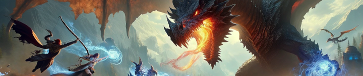

Most content can be completed with a solid trio. While all trios can make it through most content, some are stronger than others. In general, picking a tank, a damage, and a healer will get you through most content. Some synergies, like Enchanter/Wizard, or Rogue/Necro are also very viable. The more advanced trios might be more of a chore to level and get geared/AA'd up, but they will out perform more generic combos in the long run.

| Tanks                           | Damage                         | Heals                          |
|---------------------------------|--------------------------------|--------------------------------|
| * [Paladin](images/pal.md)             | * [Bard](images/brd.md)               | * [Cleric](images/clr.md)             |
| * [Shadowknight](images/shd.md)        | * [Beastlord](images/bst.md)          | * [Druid](images/dru.md)              |
| * [Warrior](images/war.md)             | * [Berserker](images/ber.md)          | * [Shaman](images/shm.md)             |
|                                 | * [Monk](mnk.md)               |                                |
|                                 | * [Ranger](rng.md)             |                                |
|                                 | * [Rogue](rog.md)              |                                |
|                                 | * [Necromancer](nec.md)        |                                |
|                                 | * [Wizard](wiz.md)             |                                |
|                                 | * [Magician](mag.md)           |                                |
|                                 | * [Enchanter](enc.md)          |                                |
