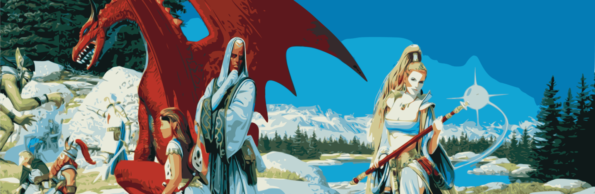

## If you have ANY questions that aren’t answered here, please join us in Discord or ask in the OOC channel in game!

## Why are Iksars, Vah Shir, Beastlords, and Berserkers locked for me?

- When you first start on Retribution only classic race/class combos are available.

## Well then how do I make my Iksar master race trio?

- Create any non expansion-restricted Race/Class combos and unlock access to Kunark for your account!

## What do you mean non expansion-restricted Race/Class combos?

- This is a personal (account based) progression server. Until you unlock the expansion required (ie. Kunark for Iksars, Luclin for Vah-Shir/Beastlords, and PoP for Berserkers) you won’t be able to create any characters with any of those combinations. But don’t worry, there are ways to change your Race in game after you unlock them!

## Ok, so how do I unlock these expansions?

- You can slay dragons (specific raid target kills) or hunt for specific rare, Apocryphal items in each expansion! A detailed list with potential side options can be found here **[Progression Guide](/progression)**.

## What expansions can I unlock on Retribution?

- All players begin in Classic, and can unlock Kunark, Velious, Luclin, Planes of Power, and GoD (beta)!

## What classes do you recommend?

- Honestly every class has access to some great AA to start with, and the availability of Apocryphal and Rose Colored gear make every class pretty awesome. A detailed list with potential class make-ups, can be found here **[Classes](spells/_index.en.md/)**.

## Ok, cool. I made my characters, now where do I start?

- Open your AA window (Alt+V by default) and see what AA you started with. Make a hotkey for any active AA’s you have by clicking on the AA and clicking Make Hotkey. Drag it to your bar to use it.
- You’ll notice one of your starting AA is Bazaar Portal. (If it shows as Origin, you may need to download and run the patcher again). You’ll also notice you started with a book. Right click and read the book. Click your newly made Bazaar Portal hotkey, and turn in that book to A Fading Memory in Bazaar. This will give you your first two pieces of Apocryphal Gear!

## Awesome! So, how do I get back to where I was?

- Well, you can go back to your starting zone by hailing the Return Home NPC near where you teleported into Bazaar at, or you can click the Bazaar Portal AA again while inside the Bazaar to be taken back to exactly where you were before! You can also talk to Tearel in the main building for a list of locations you have discovered to travel back to, or use his teleportation stone feature at his floating map!

## His… floating… map?

- It functions as a guild teleporter. Buy a stone from Tearel next to the map, and hand it back in to him to change the destination of the map! All you have to do is click the map and confirm where you want to go. This is very useful for getting to a new area for the first time. More information about the transportations system, can be found here **[Bazaar](/bazaar)**.

## Now that I’ve hit 51, farmed some gear and some AA’s, how do I unlock the next expansion?

- You can either earn enough progression points by slaying dragons (ie. Naggy and Vox) or by completing a collection quest that includes four specific items. A more comprehensive list can be found here **[Progression Guide](/progression)**.

## Wow, I might need some better gear if I want to raid…

- Apocryphal gear from any group mobs have highly enhanced stats based on the core item. You can farm some yourself or check out what players are selling in the Bazaar. If you want an easy way to search, check out The Retribution **[Bazaar Search](https://retributioneq.com/magelo/index.php?page=bazaar)**.

## That’s some nice gear… but I quit before Heroic Stats and all this other stuff, what does it all do?

- All stats and differences between Normal/Rose/Apocryphal, can be found here **[Items-scaling](/Items-Scaling)**.

## I’ve seen people talking about MQ, is Macroquest allowed?

- MQ/E3 is fine for most basic functionality. We even have some MQ developers that player here. However, it is to be understood that warping and unattended play are forbidden. Just don’t be a fool and follow the rules outlined in Discord. An excellent place to start, is the **[E3](https://discord.gg/3fnPC45H6P)** Discord.

## I have X problem, and I need Cata/Aporia to look at it?

- Do not ping them unless its game breaking, submit a bug-report in the **[Discord](https://discord.gg/ST429GN4rv)**.

## I am getting this error (The code execution cannot proceed because d3dx9_30.dll was not found. Reinstalling the program may fix this problem), what do I do?

- Follow the steps here (**[Directx Fix](https://answers.microsoft.com/en-us/windows/forum/all/directx-june-2010-asks-what-location-to-put/5e5ba845-09eb-4209-8a4c-d00e92cb0724)**), and it should clear up frequently seen directx related errors.