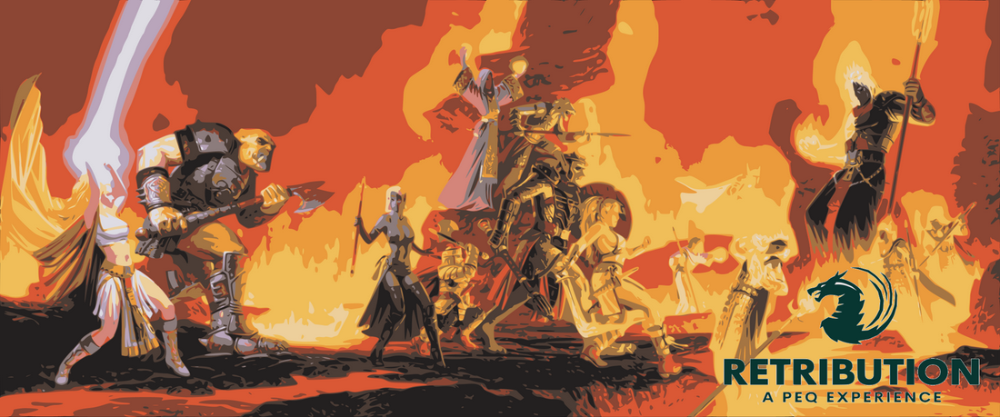

# Welcome to the Retribution Wiki

---

## Quick Links
- **[Getting Started](/new-players)** - Guides and tips for new players.
- **[Discord](https://discord.gg/ST429GN4rv)** - Join our community on Discord!
- **[Progression Guide](/progression)** - Your roadmap through the game's content.

---

## Tools
- **[Magelo](https://retributioneq.com/magelo/)** - Character and inventory management.
- **[Allaclone](https://retributioneq.com/allaclone/)** - Detailed database of game items and quests.
- **[Character Mover](https://retributioneq.com/magelo/index.php?page=charmove)** - Easily transfer characters between accounts.

---

## Game Information
- **[Class Information](/classes)** - Detailed guides and strategies for each class.
- **[Epic Quests](/epics)** - Step-by-step instructions to complete your epic quests.
- **[Fast Travel How To](/teleport)** - Learn about fast travel options and how to use them.

---

## Resources
- **[ZEM Values](/zem)** - Zone Experience Modifiers to maximize your leveling.
- **[Bazaar](/bazaar)** - Trading hub information and tips.
- **[Recommended Builds](/builds)** - Suggested builds for various classes and playstyles.

---

Feel free to explore and contribute to the Retribution Wiki! Let's build a great community together.

