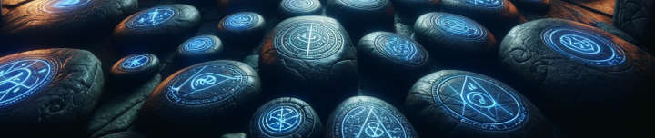

## Tearel

Tearel in the bazaar can be used to teleport to various destinations for a fee. You unlock them account wide by visiting certain areas within each zone.

- Using Echo of Memory x5 (Alt Currency) will unlock the ability to teleport your group (and raid). Echo of Memory is currently a Donation Only Item.

- Teleporting is free levels 1-19.
- Teleporting is 5pp levels 20-51.
- Teleporting is 25pp levels 52-60.
- Teleporting is 75pp levels 61-65.
- Teleporting is 150pp levels 66-99.

The Magic Map can be aligned to a few of the more commonly used zones. Buying a stone from Tearel and handing it back to him, will align his magic map to the zone you want.

- A Field Bone
- Chunk of Everfrost
- Forest Emerald of Faydar
- Fragment of West Wastes
- Frozen Shard of Iceclad
- Grassy Pebble of The Commonlands
- Karana Plains Pebble
- Opal of Toxxulia
- Scarlet Sand
- Seeds of the Hanging Gardens
- Shattered Bone of the Dreadlands

## The Polymorphist

The Polymorphist in the Bazaar now offers race and gender changes (eventually they will offer name and pet name changes as well).

## Apocrypha - Individual Buffs

- Buffs are free for players level 1-20.
- Buffs cost 10pp for players between level 21-46
- Buffs cost 100pp for players between level 46-60
- Buffs cost 250pp for players level 61+
- Apocrypha offers double-duration buffs at triple the cost. Base duration increased to 2 hours.

## Apocrypha - Server Wide Buffs

- Apocrypha also offers some server wide buffs, that can be purchased for Echoes of Memory (Alt Currency). These buffs, begin when turned on for ALL players online, and ANY PLAYER that logs in for the next 4 hours. The duration of these buffs cannot be prolonged by staying in the bazaar or PoK and will always end 4 hours after beginning. These buffs CAN be extended by activating them again before they disappear.

    - Echo of Experience (50% exp bonus)
    - Echo of Aegolism (HP/AC)
    - Echo of Focus (STR/AGI/DEX/STA)
    - Echo of Selo (Base selos movement)
    - Echo of Koadic (Mana Regen/INT/WIS)
    - Echo of the Brood (Haste)
    - Echo of the Grove (Regen)

## A Distant Memory

- A Distant Memory, can take 4x regular items (the same item), and with a fee (500pp) upgrade them into a Rose version of that item. With the same scaling, it can also take 4x Rose items (the same item), and with a fee (2000pp) upgrade them into an Apocryphal version of that item.

## A Mischievous Halfling

- The Casino of Retribution, hand him 5000pp and you will have a chance at winning some useful items.

## A Perveyor of Glamour

- A Perveyor of Glamour will take 5000pp and an item you have, and turn it into a Glamour-Stone. A Glamour-Stone can be used as a weapon ornamentation, and it will change the look of your weapon. Additionally, you can offer her Echoes of Memory (Alt Currency) for a chance at a random Glamour-Stone. This pulls from all weapons in the database, and can be anything from a Rusty Dagger, to an Epic.