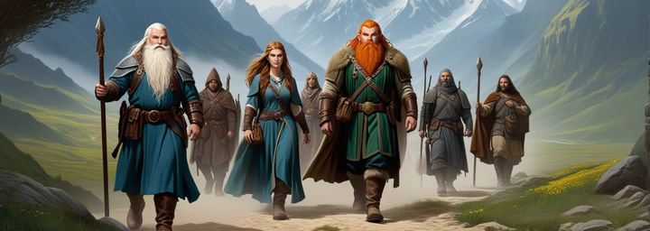

# Getting Started with Retribution

Welcome to Retribution, a unique personal progression PEQ server that allows you to relive the adventures and challenges of Everquest in new and exciting ways. Dive into the details below to get started on your journey!

---

## What is Retribution?

Retribution is an account-based, personal progression PEQ server that is not affiliated with Daybreak Games. It offers players a chance to relive forgotten memories of their Everquest conquests through a distinctive blend of rulesets, quests, and items.

---

## Ruleset Overview

- **Start in Classic EQ:** Progress through Gates of Discord by defeating raid bosses or collecting specific items from each expansion.
- **Account-Based Progression:** You must actively participate to unlock each expansion for your account.

---

## Unique Features of Retribution

- **Pre-Selected Abilities:** Start with class-defining AA and the ability to teleport to the ORIGINAL bazaar.
- **Enhanced Gear:** Access new, powerful versions of starting items. Gear can be found in Rose Colored (1.5x Stats) or Apocryphal (2x Stats + Bonuses) forms, reminiscent of past glories.
- **Limited Multi-Boxing:** Players are limited to three boxing + 1 Bazaar mule, fostering a more balanced and competitive environment.

---

## Additional Key Facts

- **No Level Requirements:** Wearable items do not have required or recommended levels.
- **Trade and Attune:** All items are tradable; Apocryphal versions are attunable.
- **Reduced Lockouts:** Instanced raid content (AoCs) is available for every progression raid zone with a low 22-hour lockout.
- **Restored Classic Zones:** Experience the classic versions of many favorite zones.
- **Faster Spawns:** Enemy and named spawn rates are decreased to 10 minutes in almost all zones.
- **Enhanced Regeneration:** Benefit from RoF Out of Combat Regen.
- **Integrated Chat:** OOC and AUC chat feed into our Discord server, connecting you with friends even when offline.
- **Special Level Caps:** Level caps are adjusted to allow AA grinding; Classic is capped at 51 instead of 50.
- **Accessible AA:** All AA through The Buried Sea are live and attainable from level 51.
- **Big Bags:** Carry more with larger bag sizes!

---

## Installation Instructions

Ready to embark on your Retribution adventure? Follow these steps to get set up:

1. **Create an EQ Emulator Account:** Start by creating an account on [EQ Emulator](http://www.eqemulator.org/).
2. **Login Server Account:** Then, [create a login server account](http://www.eqemulator.org/account/?CreateLS).
3. **Download Retribution Patcher:** Download the Retribution patcher.zip from [here](https://retributioneq.com/retributioneq.zip). Make sure to mark the file as safe if prompted by Windows.
4. **Install the Game:**
    - Right-click the zipped download, go to properties, and check "Unblock" in the lower right. Then, extract the files to your preferred installation directory. Avoid running the patcher in the same folder as another PEQ server install.
    - Find and run `retributioneq.exe`. This is the file you will use to patch and play the game.
5. **Patch and Play:**
    - Click "Patch" if it appears red. This process may take some time.
    - Click "Play" once the patch is complete or if the patch button is grey and states "Complete! Press Play to begin".

Embark on your adventure and enjoy the unique experience that Retribution has to offer!

---

## FAQ

> [!question]
> I have X problem, and I need Cata/Aporia to look at it?

- Do not ping them unless its game breaking, submit a bug-report in the discord.

> [!question]
> I am getting this error (The code execution cannot proceed because d3dx9_30.dll was not found. Reinstalling the program may fix this problem), what do I do?

- Follow the steps here (**[Directx Fix](https://answers.microsoft.com/en-us/windows/forum/all/directx-june-2010-asks-what-location-to-put/5e5ba845-09eb-4209-8a4c-d00e92cb0724)**), and it should clear up frequently seen directx related errors.