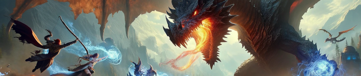

Progression is broken into expansions, with key mobs needing to be killed to unlock the next. An optional Collectors Quest, will yield the same results as the conventional flagging.

{{
}}
TODO: list every classic zone available, for quick search/unlock reference
{{
}}

## Classic Bosses to kill for Kunark Unlock
{{
}}
Found in Soluseks Eye, this is a Dragon that will challenge you with his Fire Breath attack.
{{
}}
{{
}}
Found in Permafrost, Lady Vox is a challenging dragon fight to not only get to, but also compete with her Complete Heal
{{
}}
{{
}}
Found in Kedge Keep, Phinigel will require waterbreathing and strategies to overcome his seahorse guards and wizard spells.
{{
}}

## Kunark Bosses to kill for Velious Unlock
{{
}}
Spawns and roams in the snowy area of the Dreadlands. Buff your Cold and Magic Resists as high as possible..
{{
}}
{{
}}
Spawns in the Northwest corner of Emerald Jungle, casts fear so magic resist will help.
{{
}}
{{
}}
Roams around Skyfire Mountains. A tracker can be helpful, casts fear so magic resist will help.
{{
}}
{{
}}
Spawns at the very back of the Juggernaut tunnels in Old Sebilis. Poison Resist helps for this fight. Healers can Line-of-Sight his Poison AE.
{{
}}

## Velious Bosses to kill for Luclin Unlock
{{
}}
Spawns in the southern Rat caves, past the snake pool.
{{
}}
{{
}}
Located at the entrance to Dragon Necropolis.
{{
}}
{{
}}
Lord Yelinak’s Lair is found deep within Skyshrine. He is on his own faction while the rest of the zone is on Claws of Veeshan faction.
{{
}}
{{
}}
Wuoshi spawns right at the Wizard/Druid portal in Wakening Lands. He sees invisibility so he will aggro if you if zone in and are KoS with Claws of Veeshan faction.
{{
}}
{{
}}
Spawns in the basement around the Sleeper.
{{
}}

## Luclin Bosses to kill for Planes of Power Unlock
{{
}}
Thought Horror Overfiend spawns in the back of the zone. He is permarooted so it’s easy to pull the trash out of his room.
{{
}}
{{
}}
After opening the locked door to Greg Veneficus, you’ll see a portal ahead that ports you up to his room. You must clear the entire room in order to aggro him.
{{
}}
{{
}}
Spawns in the southeast room in Akheva Ruins.
{{
}}
{{
}}
Xerkizh the Creator is pretty straight forward. He is perma-rooted and can be slowed. Pre-debuff him before engaging.
{{
}}
{{
}}
Upon first zoning into the chamber you’ll see a giant golem in the middle and 8 snakes surrounding it. The general strategy is to kill or cc snakes, and kill the Golem. Approx. 3-6 minutes after the golem dies Emperor Ssraeshza will spawn
{{
}}

## Planes of Power Bosses to kill for Gates of Discord Unlock
{{
}}
Before fighting Saryrn someone in your raid will need to have completed the  Screaming Sphere Key Quest. This key allows you to open the door to Saryrn’s Tower in the Plane of Torment.
{{
}}

## OR

{{
}}
Quarm will spawn in Phase 5 of Plane of Time.
{{
}}

# Collectors Quests

To unlock Kunark, you must collect:

- Apocryphal Elemental Binder
- Apocryphal Ghoul Scalp
- Apocryphal Crown of the Froglok Kings
- Apocryphal Djarn's Amethyst Ring

To unlock Velious, you must collect:

- Apocryphal Sebilite Scale Mask
- Apocryphal Helot Skull Helm
- Apocryphal Mask of Secrets
- Apocryphal Helm of Rile

To unlock Luclin, you must collect:

- Apocryphal Stronghorn's Horn
- Apocryphal Shackle of Auctoritias
- Apocryphal Sword of Pain
- Apocryphal Siren Hair Earring

To unlock Planes of Power, you must collect:

- Apocryphal Shadel Bandit Ring
- Apocryphal Blade of Insanity
- Apocryphal Zekhas' Katar
- Unadorned Scepter of Shadows